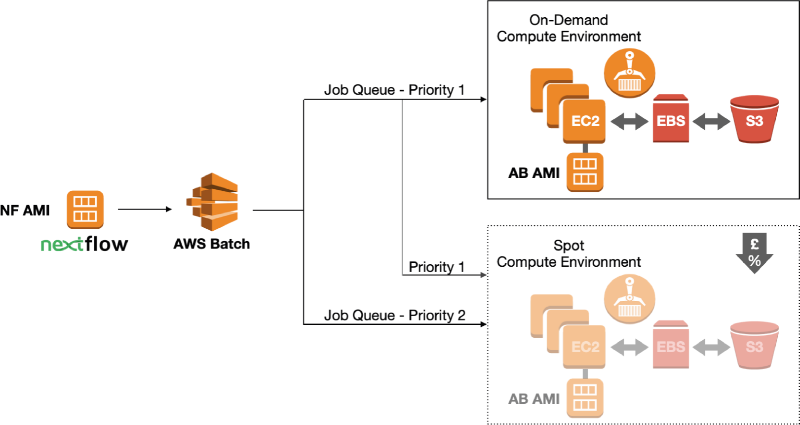

### Setting up AWS BATCH for Nextflow

Amazon Web Services Batch is a service that allows users to submit jobs to job queues, specifying the application to run and the compute resources required by the job. AWS Batch can be configured to run Nextflow processes in specified computing environments, lowering the cost of cloud resources when used in conjunction with Nextflow.




#### Basic Requirements

In order to run this, you need to have a AWS account set up and create an IAM user for it.

### Step 1: Setting up a Nextflow user with IAM

- Step 1.1 Adding a programmatic user
- Step 1.2 Create a user group
- Step 1.3 Obtain Secret Access Key
- Step 1.4 Create permission roles for running AWS Batch

### Step 1.1: Adding a programmatic user

Navigate to the IAM Service and click on Users. Then click Add user and in the User name box add the user name that you would like, here I used nextflow-programmatic-access. Then select the box for Programmatic access. When you’ve finished click the Next: Permissions button.

### Step 1.2 Create a user group

Next we need to create a group for this user to be a part of. We will later add policies to this group specific to Netflow. Click on the Create Group button.

**Attach follow policy to this group**

- AWSBatchFullAccess
- AmazonEC2FullAccess
- AmazonECS_FullAccess
- AmazonS3FullAccess

You can find these by typing them into the Filter box.

### Step 1.3: Obtain Secret Access Key

After user creation there will be a page that provides the security credentials for using the new Nextflow user. This includes the Access Key ID and Secret access key. These are crucial and are only generated once at this step. If they are lost you will have to delete and create a new user using the steps above. Click the Download .csv button and keep the file in a safe and secure location. These access credentials will be needed later.

#### Step 1.4: Create permission roles for running AWS Batch

From the IAM user panel click the Roles button. Here we will create a role for running EC2 Spot Instances. If you would rather create on-demand instances only you can skip this step, however you can achieve significant cost savings using Spot Instances. Click the Create role button.

On the create role page scroll down and find and click on EC2, and click next.
Select below mention policies, you can find these by typing them into the Filter box & then click create role

- AmazonEC2FullAccess
- AmazonS3FullAccess
- AWSBatchFullAccess
- AmazonECS_FullAccess
- AmazonEC2ContainerServiceforEC2Role
- AmazonEC2ContainerServiceRole
- AmazonEC2SpotFleetTaggingRole
- CloudWatchFullAccess


### Step 2: Building a custom Amazon Machine Image

Amazon Machine Images or AMIs are used to create EC2 compute instances on AWS Cloud. In order to use Nextflow in combination with AWS Batch we will be using AWS’s Elastic Container Service (ECS). This allows Nextflow to use Docker containers as the running environment for the steps in the workflow. For this to work there are a few additional modifications that need to be made to the base ECS image. These modifications allow Nextflow to communicate with the running instances and shuttle data between S3 Buckets, your local work environment, and running instances.

The setup and configuration of suitable AMIs is the most demanding step when creating an environment to run a pipeline on AWS. Several things have to be considered:

- Base image: It has to be ECS-compatible
- EBS storage: The attached volumes have to be large enough to contain all input, index, temporary and output files
- AWS CLI: The AMI has to contain the AWS CLI or otherwise no files can be fetch from and copied to S3 from the EBS volume
- AMIs cannot be reused for processes containing less EBS (more is possible)


### 2.1: Choose an Amazon Machine Image (AMI)

Make sure to pick a base image that supports ECS from the AWS Market Place.

### 2.2: Review & configure the new image

The next step is to choose an instance type. Since we are creating this instance to customize the AMI we can select a small instance (like t2.medium).

The next step is configuring the instance details which can be configured to how you would normally set up an instance for interactive access. The default settings works fine.

In the add storage step we have an option to update the space available to the Docker container. By default the space is set to 30 GB. This is the allowed space that can be used by docker on the image. Update the storage space for the needs of your pipeline.

Under Configure storage change root volume to gp3.


### 2.3: SSH connect to instance

Now right click and hit Connect to get your ssh connect command to your instance. You might have to change the default root user to ec2-user.

### 2.4: Install AWS CLI

Nextflow requires the AWS CLI to copy files such as input files and indices from and output files to S3.

Use the following lines to add it to your AMI:

```
sudo yum install -y bzip2 wget
wget https://repo.continuum.io/miniconda/Miniconda3-latest-Linux-x86_64.sh
bash Miniconda3-latest-Linux-x86_64.sh -b -f -p $HOME/miniconda
$HOME/miniconda/bin/conda install -c conda-forge -y awscli
rm Miniconda3-latest-Linux-x86_64.sh
# Test the installation
./miniconda/bin/aws --version
aws-cli/1.27.37 Python/3.10.8 Linux/4.14.296-222.539.amzn2.x86_64 botocore/1.29.37
```
### 2.5: Save your AMI

Now you can go back to your EC2 instance dashboard and save your AMI by right clicking and going for Image -> Create Image.

**Note: Don’t forget to terminate your running EC2 instance from which you created the AMI to get prevent any running EBS and EC2 costs.**

### Step 3: Creating compute environments and job queues

First, we want to create a new compute environment upon which we can base job queues. For this, go to the AWS Batch dashboard -> Compute Environments.

### Naming, roles and permissions

First, we want to have a managed environment, so AWS Batch can do configuration and scaling for us. Now, we can name our compute environment. Then we simply select the service and instance roles as well as keypairs we created earlier in the prerequisite section, there should be only one option to choose from.

- Compute Environment
- Log in to AWS Batch
- Navigation menu: “Compute environments”
- “Create a new compute environment”
- Select “Managed”
- Provide a name for the Compute Environment
- Service role AWSBatchServiceRole
- Instance role : attach name of role created in Step 1.4
- EC2 key pair: The key pair of the IAM user you intend to use for running AWS Batch jobs
- Select “on-demand” or “spot” (spot is cheaper)
- Select Maximum Price you’re willing to pay for spot instances
- Spot fleet role AmazonEC2SpotFleetRole
- Enable user-specified AMI id ( amazon linux machine 2) and provide the AMI id you created at step 2.5
- If desired, attach a Key/Value pair to make it possible to later generate

### Step 4: Creating job queues

Now we need to create a job queue and associated this with our compute environment. This step is actually pretty easy and straightforward.

#### First go to Job queues and click Create Queue.

Next we need to create a queue where Nextflow can submit jobs to the compute environment. Navigate to the Batch service on the AWS management console and select Job queues and Create queue.

Enter the name of the queue (this will be needed later in nextflow) and give it a priority. A priority of 1 means that jobs submitted to the compute environment via this queue will have priority over jobs submitted via a queue with a lower priority. This does not matter if you only have 1 queue using the compute environment but if you have multiple queues you can define their priorities. Finally in the dropdown box select the compute environment we created in the previous section and click Create job queue.

### Step 5: Setting up a S3 Bucket for data access

Nextflow can use S3 buckets to store and access data. Go to the S3 service under the AWS management console and select Create bucket. Name the bucket (will be used in the nextflow configuration) and select the appropriate region where you have configured everything else and select Create bucket.

### Step 6: Configuring Nextflow to use AWS Batch

There are a few parameters that need to be added to the Nextflow config in order to use the AWS Batch environment we created.

Specify your credentials in the Nextflow configuration file

```
aws {
    accessKey = ''
    secretKey = ''
    region = 'ap-south-1'
    batch.cliPath = '/home/ec2-user/miniconda/bin/aws'
}

process {
  withName: FASTQC {
  executor = 'awsbatch'
  queue = 'nextflow-job-queue'
  container = 'staphb/fastqc:latest'
  }
}

workDir = 's3://bix-nf-bucket/workDir/'

```
## Testing the setting by running the a test run

### Install nextflow :

Nextflow does not require any installation procedure, just download the distribution package by copying and pasting this command in your terminal:

```
curl -fsSL https://get.nextflow.io | bash

```

It creates the nextflow executable file in the current directory. You may want to move it to a folder accessible from your $PATH.

### Running the test pipeline

```
nextflow run https://github.com/Ankita-1211/integration-aws-batch-nextflow.git -r main -c nextflow.config --input_dir s3://testing-nf-integration/input/ --output_dir s3://testing-nf-integration/output/

```
Note: the aws credentials need to be added to the nextflow.config file.
